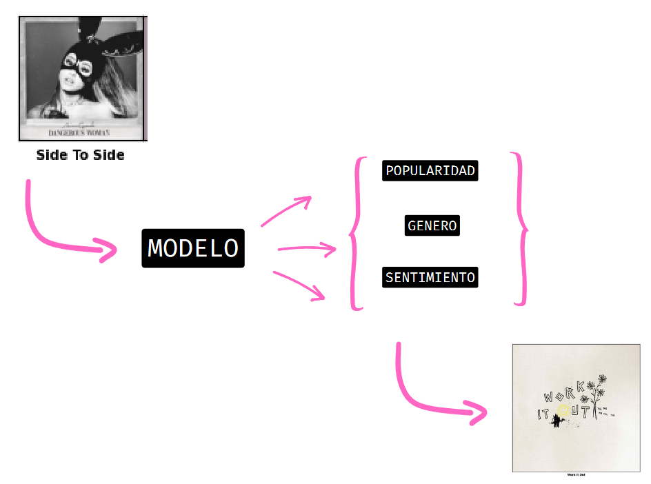

# spotify-recommender

**banner here**

sistema de recomendacion de canciones de spotify basado en gustos musicales, proyecto realizado para la materia de IA-1 en la UIS

## Autores

Fabian Perez, Paula Arguello, Manuel Herrera

## Objetivo

Desarrollar un **sistema de recomendación de canciones** para *Spotify* basado en inteligencia artificial que, a partir del análisis de los gustos musicales de un usuario, sea capaz de predecir y sugerir con precisión canciones que se ajusten a sus preferencias personales.

## Requirements

Para poder ejecutar el notebook es necesario instalar las librerias que se encuentran en `requirements.txt` asi:

```bash
pip install -r requirements.txt
```

## Dataset

El dataset utilizado para el desarrollo del proyecto se encuentra en kaggle, se llama [Spotify Tracks DB](https://www.kaggle.com/datasets/zaheenhamidani/ultimate-spotify-tracks-db) y contiene 232,725 canciones de spotify con sus respectivos atributos, para mas informacion de los atributos se puede acceder a la documentacion de la API de spotify [aqui](https://developer.spotify.com/documentation/web-api/reference/get-audio-features).

En la seccion de procesamiento del [notebook](./main.ipynb) se elabora en el proceso de limpieza y preprocesamiento de los datos.

Para este proyecto se agrego un atributo llamado `sentyment`, este atributo se obtuvo a partir de una combinacion de los atributos `valence` y `energy` de cada cancion como se muestra en la figura:


cada *punto* es una cancion, y segun el cuadrante en el que se encuentre se le asigna el valor del sentimiento, las canciones que queden dentro de la **region sombreada** tendran un sentimiento neutral asociado debido a la incertidumbre

## Modelos

Dense Neural Networks, Decision Tree.


## Metodo

Se usaron 3 modelos de aprendizaje automatico para la prediccion de canciones, cada uno de estos modelos tiene una tarea en especifico.

- El **modelo 1** predice el `genero` de una cancion a partir de sus atributos
- El **modelo 2** predice la `popularidad` de una cancion a partir de sus atributos
- El **modelo 3** predice el `sentimiento` de una cancion a partir de sus atributos

luego a partir de esta inferencia, se busca en el dataset el top 5 canciones que maximicen la similaridad del coseno con la cancion de entrada, es decir, se busca las 5 canciones mas parecidas a la cancion de entrada.

Todo el metodo se desarrolla en el [notebook](./main.ipynb)

> Para ejecutar la parte de la inferencia del notebook es necesario especificar una playlist de la cual se van a recuperar 5 canciones para la inferencia. Esta playlist debe ser publica y debe tener al menos 5 canciones

## Resultados

A continuacion se muestra un ejemplo de ejecucion a partir de una cancion de entrada



## Video

Se realizo un video explicando el proyecto, se puede acceder a el aqui:

https://www.youtube.com/watch?v=jaUXFd7hfJ8